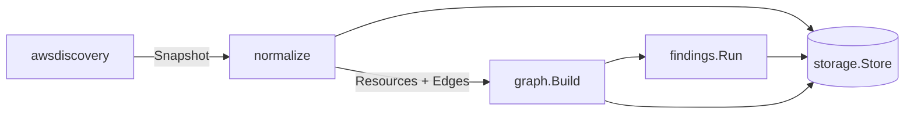

# Architecture

InfraLens is a single Go CLI binary, not a client/server web application. There is no frontend to serve and no API to version; every command runs a self-contained pipeline against local state and AWS APIs.

## Principles

- CLI-first: every capability is a command with structured (JSON) and human-readable output. Anything else — a TUI, a local web viewer — is an optional layer on top of the same commands, not a separate product.
- Raw AWS SDK shapes never leave the `awsdiscovery` package. Everything downstream (`normalize`, `graph`, `findings`, `storage`, `export`) works only with InfraLens's own `resource.Resource` / `resource.Edge` types.
- Discovery, normalization, graph construction, and findings evaluation are separate packages with one-directional dependencies, so each is independently testable without AWS credentials or a database.
- Storage is accessed through a `Store` interface (`internal/storage`), not a concrete SQLite type, so a PostgreSQL implementation can be added later without touching the CLI or domain packages.
- Start with a monolith and a stdlib-only CLI. The only external dependencies are the AWS SDK (required for discovery) and a pure-Go SQLite driver (required for persistence without a cgo toolchain) — no web framework, no ORM, no CLI framework.

## Package Boundaries

```text
cmd/infralens        entrypoint; delegates immediately to internal/cli
internal/cli         flag parsing, command dispatch, output formatting
internal/config      merges defaults, config file, env vars, and flags
internal/resource     shared domain types: Resource, Edge, Scan
internal/awsdiscovery AWS SDK calls (read-only), Discoverer interface, raw types
internal/normalize    raw awsdiscovery.Snapshot -> []resource.Resource, []resource.Edge
internal/graph        adjacency index over resources/edges + traversal
internal/findings     Rule interface + built-in exposure/topology rules
internal/storage       Store interface
internal/storage/sqlite SQLite implementation of Store
internal/export        JSON, CSV, DOT serializers
internal/diff           resource/edge set comparison between two scans
```

Dependency direction is strictly downstream: `cli` depends on everything; `resource` depends on nothing. `awsdiscovery` has no dependency on `resource` — it only produces plain Go structs — so `normalize` is the single seam where AWS's data model becomes InfraLens's data model.

## Scan Pipeline



1. `infralens scan` resolves AWS credentials via the standard SDK chain (profile, environment, assumed role, or instance role) and calls read-only discovery APIs for each supported service.
2. `normalize` maps raw API responses into `resource.Resource` and `resource.Edge` values, including structural edges (VPC contains Subnet, Instance is member-of SecurityGroup, RouteTable routes-to Subnet, VPC attached-to InternetGateway).
3. `graph.Build` indexes resources and edges for traversal.
4. `findings.Run` evaluates rules against the graph (open security groups, public S3 buckets, internet-reachable instances) and produces `Finding` records.
5. `storage.Store` persists the scan, its resources, edges, and findings to SQLite, keyed by a scan ID.
6. `graph`, `findings`, `diff`, and `export` commands operate on stored scans after the fact — they don't require AWS credentials or network access, only the local database.

## Storage

SQLite is the default and only implementation today, chosen because InfraLens's data — scans, resources, edges, findings — is strongly structured and a single local file matches the tool's "runs on your laptop or in CI" model with zero setup. The pure-Go `modernc.org/sqlite` driver is used specifically to avoid a cgo build requirement, keeping `go build` sufficient to produce a portable binary.

`internal/storage.Store` is the seam for a future PostgreSQL backend (e.g. for teams centralizing scan history): any implementation satisfying the interface can be swapped in via `internal/cli` without changes to discovery, graph, or findings code.

## The Frontend

The `frontend/` directory contains a React shell from an earlier phase where the product was envisioned as a web app. That framing has been replaced by the CLI described here. The directory is kept only as deprecated, optional tooling — see `frontend/README.md` — and is not built, tested, or shipped as part of InfraLens. A local web viewer may return later as a thin layer over `infralens serve` (see roadmap), but only once the CLI itself is complete.
